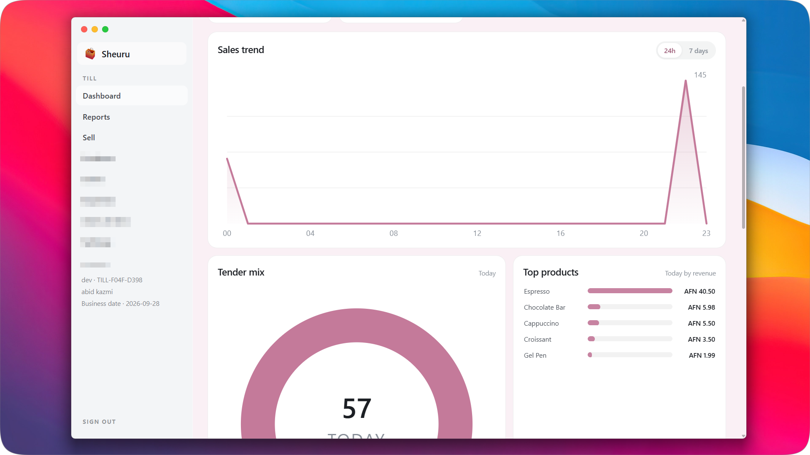
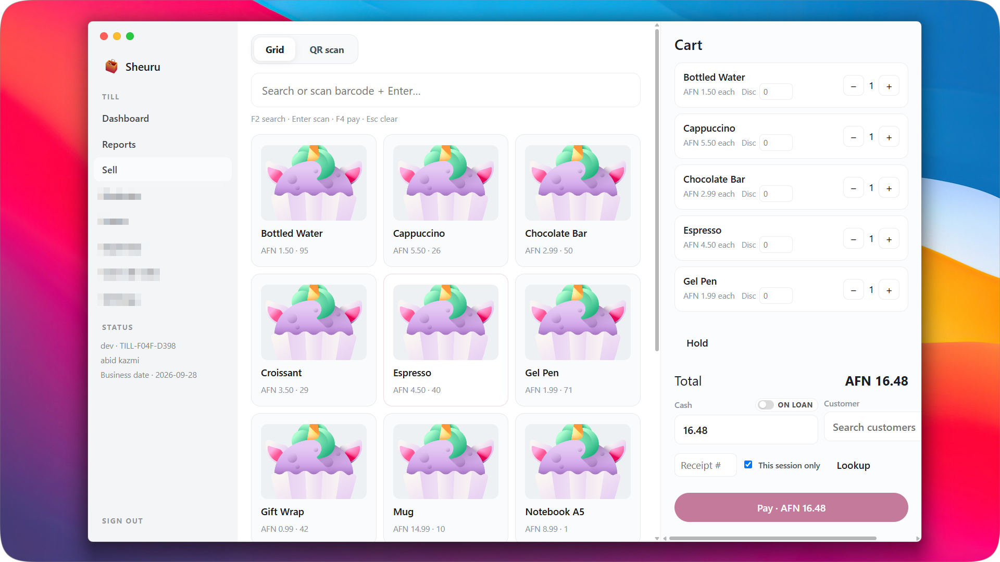
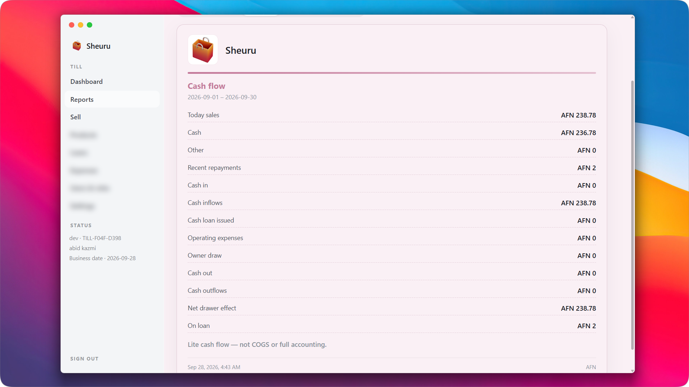

# Hi, I'm Kazmi

I build software that businesses and organizations run on every day: ERP platforms, point-of-sale systems, internal tools, and reporting dashboards. Most of my work is for NGOs, manufacturing companies, and educational institutions.

## Experience

The systems I have built are in daily use, including at an Ontario college ([link here](https://example.com)). I work on the whole product, from understanding what finance, HR, sales, and operations teams need, to the data model underneath, to an interface people actually enjoy using.

* ERP platforms for NGOs covering budgets, fiscal periods, grants and awards, accounting, invoices, time off, and employee management
* A point-of-sale system with a sell screen, barcode scanning, inventory, loans, expenses, and cash flow reports
* Inventory, production, and order management for manufacturing
* Dashboards that turn finance, stock, and project data into something a manager can read in a minute
* Data modeling and SQL for reporting and master data cleanup

## ERP for NGOs

Budgeting, grants, accounting, invoicing, and HR in one system, with approval rules, budget commitments, and donor-ready reporting.

<table>
  <tr>
    <td></td>
    <td></td>
  </tr>
  <tr>
    <td></td>
    <td></td>
  </tr>
  <tr>
    <td></td>
    <td></td>
  </tr>
  <tr>
    <td colspan="2"></td>
  </tr>
</table>

## Point of Sale

A fast till for small businesses: quick selling, stock tracking, credit sales on loan, and daily cash flow reports.

<table>
  <tr>
    <td></td>
    <td></td>
  </tr>
  <tr>
    <td colspan="2"></td>
  </tr>
</table>

## What I've built

| Project | Domain | What it does | Stack |
|---|---|---|---|
| [Project name](link) | Education | Used at an Ontario college | [stack] |
| [Project name](link) | NGO | Budgets, grants, accounting, HR | [stack] |
| [Project name](link) | Retail | Point of sale, inventory, cash flow | [stack] |

## Tech I work with

* **Languages:** Rust, TypeScript (and I don't write `any`), Python, SQL
* **Frontend:** React (sometimes Native), Next.js, Tailwind
* **Desktop:** Electron & Tauri
* **Backend:** Node.js frameworks, FastAPI, Django
* **Data and reporting:** [MySQL / PostgreSQL], [Power BI, if true]
* **Architecture:** Turborepo and monorepos, serverless (not fully serverless)
* **AI:** LangChain and LangGraph, because I love building AI apps

## Working with me

Open to freelance work on ERP systems, internal tools, and data and reporting.

[Email](mailto:abidkazmi729@gmail.com) | [Freelancer profile](https://www.freelancer.com/u/abidk250)
